# Design to Code: Paper + Claude Code via MCP

> Architecture diagram for one validated build inside the parent domain. Source document: [`../documents/04-paper-design-to-code-mcp.md`](../documents/04-paper-design-to-code-mcp.md).

```mermaid
---
title: "Design to Code: Paper + Claude Code via MCP"
---
%%{init: {"theme":"base","themeVariables": {"primaryColor":"#1B4332","primaryTextColor":"#F4D03F","primaryBorderColor":"#F4D03F","secondaryColor":"#264653","tertiaryColor":"#2F5233","lineColor":"#F4D03F","fontFamily":"ui-monospace, SFMono-Regular, Menlo, Consolas, monospace","fontSize":"13px"}}}%%
flowchart LR
    classDef datastore fill:#264653,stroke:#F4D03F,stroke-width:2px,color:#FFFFFF
    classDef service fill:#1B4332,stroke:#F4D03F,stroke-width:2px,color:#F4D03F
    classDef event fill:#7B42BC,stroke:#F4D03F,stroke-width:2px,color:#FFFFFF
    classDef io fill:#0d1117,stroke:#F4D03F,stroke-width:1.5px,color:#F4D03F,font-style:italic




    subgraph DesignSurface["Code-Native Design Surface"]
        Designer[/"Designer Prompt"/]
        Paper("Paper Canvas")
        DOMModel{{"Flexbox DOM Model"}}
    end

    subgraph AIBridge["AI Bridge (MCP)"]
        MCP{{"MCP Channel"}}
        Claude("Claude Code Generator")
    end

    subgraph CodeOutput["React + Tailwind Output"]
        ReactApp("React Components")
        Tailwind("Tailwind Classes")
        Repo[("Production Repo")]
    end

    Designer -- "layout intent" --> Paper
    Paper -- "DOM-mapped tree" --> DOMModel
    DOMModel -- "shared representation" --> MCP
    MCP -- "canvas context" --> Claude
    Claude -- "writes JSX" --> ReactApp
    Claude -- "applies utilities" --> Tailwind
    ReactApp -- "commits build" --> Repo
    Tailwind -- "styles build" --> Repo
    Claude -. "edits canvas back" .-> Paper
class Repo datastore
class DOMModel,MCP event

    class Repo datastore
    class Paper,Claude,ReactApp,Tailwind service
    class DOMModel,MCP event
    class Designer io
```

The diagram is hand-prompted from the build's content (LLM-generated, post-normalized for the Purpose Engineering visual theme). The full narrative, with screenshots and command outputs, lives in the source document linked above.
