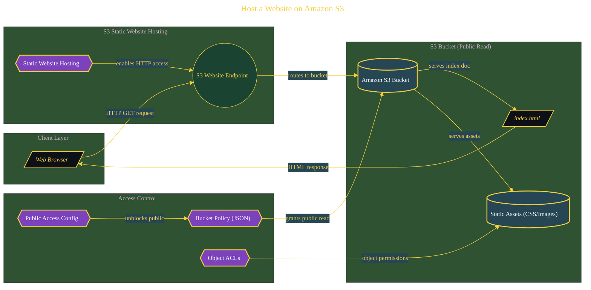

# Host a Website on Amazon S3

> Architecture diagram for one validated build inside the parent domain. Source document: [`../documents/01-aws-host-a-website-on-s3.md`](../documents/01-aws-host-a-website-on-s3.md).

The diagram is hand-prompted from the build's content (LLM-generated, post-normalized for the Purpose Engineering visual theme). The full narrative, with screenshots and command outputs, lives in the source document linked above.
