# Connect a GitHub Repo with AWS

> Architecture diagram for one validated build inside the parent domain. Source document: [`../documents/02-source-control-github.md`](../documents/02-source-control-github.md).

```mermaid
---
title: Connect a GitHub Repo with AWS
---
%%{init: {"theme":"base","themeVariables": {"primaryColor":"#1B4332","primaryTextColor":"#F4D03F","primaryBorderColor":"#F4D03F","secondaryColor":"#264653","tertiaryColor":"#2F5233","lineColor":"#F4D03F","fontFamily":"ui-monospace, SFMono-Regular, Menlo, Consolas, monospace","fontSize":"13px"}}}%%
flowchart LR
    classDef datastore fill:#264653,stroke:#F4D03F,stroke-width:2px,color:#FFFFFF
    classDef service fill:#1B4332,stroke:#F4D03F,stroke-width:2px,color:#F4D03F
    classDef event fill:#7B42BC,stroke:#F4D03F,stroke-width:2px,color:#FFFFFF
    classDef io fill:#0d1117,stroke:#F4D03F,stroke-width:1.5px,color:#F4D03F,font-style:italic




    subgraph DevHost["EC2 Development Host"]
        VSCode[/"VS Code Remote SSH"/]
        ProjectDir("Java Web App Project")
        LocalRepo[("Local Git Repository")]
    end

    subgraph GitOps["Git Operations"]
        Commits{{"Commits and Branches"}}
        PushOp{{"HTTPS Push"}}
    end

    subgraph AuthLayer["Token-Based Auth"]
        PAT[/"GitHub Personal Token"/]
        RejectedPwd("Password Auth - REJECTED")
    end

    subgraph Remote["GitHub Remote"]
        RepoRemote[("GitHub Repository")]
        History("Traceable Commit History")
    end

    VSCode -- "edit on host" --> ProjectDir
    ProjectDir -- "git add" --> LocalRepo
    LocalRepo -- "git commit" --> Commits
    Commits -- "stage for push" --> PushOp
    PAT -- "auth credential" --> PushOp
    PushOp -- "rejects HTTPS pwd" --> RejectedPwd
    PushOp -- "sync to origin" --> RepoRemote
    RepoRemote -- "records changes" --> History
class LocalRepo,RepoRemote datastore
class Commits,PushOp event

    class LocalRepo,RepoRemote datastore
    class ProjectDir,RejectedPwd,History service
    class Commits,PushOp event
    class VSCode,PAT io
```

The diagram is hand-prompted from the build's content (LLM-generated, post-normalized for the Purpose Engineering visual theme). The full narrative, with screenshots and command outputs, lives in the source document linked above.
