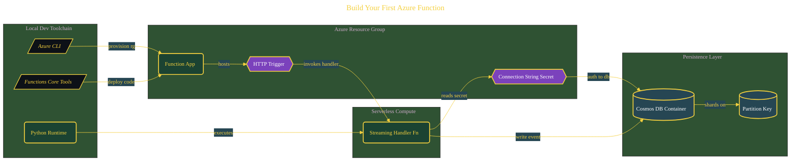

# Build Your First Azure Function

> Architecture diagram for one validated build inside the parent domain. Source document: [`../documents/01-ai-azure-streaming-backend.md`](../documents/01-ai-azure-streaming-backend.md).

The diagram is hand-prompted from the build's content (LLM-generated, post-normalized for the Purpose Engineering visual theme). The full narrative, with screenshots and command outputs, lives in the source document linked above.
