# Build an AI Security Scanner with Gemini

> Architecture diagram for one validated build inside the parent domain. Source document: [`../documents/02-ai-security-audit.md`](../documents/02-ai-security-audit.md).

```mermaid
---
title: Build an AI Security Scanner with Gemini
---
%%{init: {"theme":"base","themeVariables": {"primaryColor":"#1B4332","primaryTextColor":"#F4D03F","primaryBorderColor":"#F4D03F","secondaryColor":"#264653","tertiaryColor":"#2F5233","lineColor":"#F4D03F","fontFamily":"ui-monospace, SFMono-Regular, Menlo, Consolas, monospace","fontSize":"13px"}}}%%
flowchart LR
    classDef datastore fill:#264653,stroke:#F4D03F,stroke-width:2px,color:#FFFFFF
    classDef service fill:#1B4332,stroke:#F4D03F,stroke-width:2px,color:#F4D03F
    classDef event fill:#7B42BC,stroke:#F4D03F,stroke-width:2px,color:#FFFFFF
    classDef io fill:#0d1117,stroke:#F4D03F,stroke-width:1.5px,color:#F4D03F,font-style:italic




    subgraph CLI["CLI Entry"]
        Operator[/"Security Engineer"/]
        Scanner("scanner.py CLI")
    end

    subgraph Inputs["Code Under Audit"]
        TargetCode[("Target Python File")]
        PromptLib("Security Prompt Templates")
    end

    subgraph AIAnalysis["AI Analysis"]
        GeminiAPI{{"Google Gemini API"}}
        Parser("Response Parser")
    end

    subgraph Output["Severity Output"]
        Colorama("Colorama Renderer")
        Findings[/"Color-Coded Findings"/]
    end

    Operator -- "scan request" --> Scanner
    Scanner -- "load source" --> TargetCode
    Scanner -- "build prompt" --> PromptLib
    PromptLib -- "structured prompt" --> GeminiAPI
    TargetCode -- "code payload" --> GeminiAPI
    GeminiAPI -- "vuln assessment" --> Parser
    Parser -- "severity tags" --> Colorama
    Colorama -- "render to terminal" --> Findings
    Findings -- "review and triage" --> Operator
class TargetCode datastore
class GeminiAPI event

    class TargetCode datastore
    class Scanner,PromptLib,Parser,Colorama service
    class GeminiAPI event
    class Operator,Findings io
```

The diagram is hand-prompted from the build's content (LLM-generated, post-normalized for the Purpose Engineering visual theme). The full narrative, with screenshots and command outputs, lives in the source document linked above.
