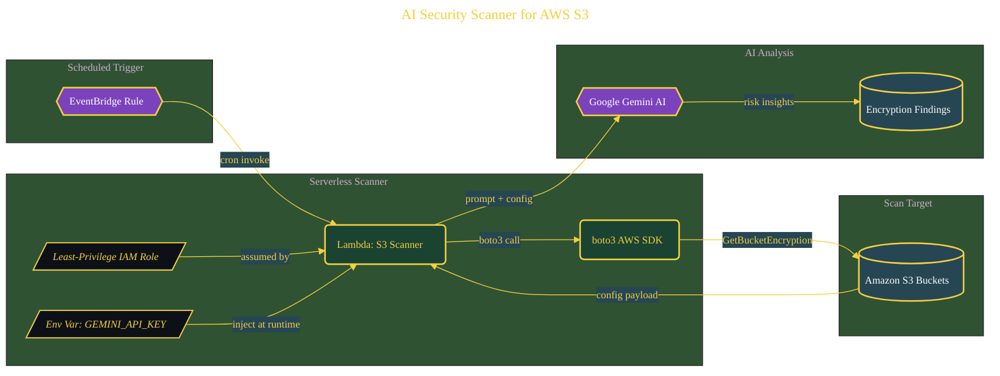

# AI Security Scanner for AWS S3

> Architecture diagram for one validated build inside the parent domain. Source document: [`../documents/03-ai-aws-s3-security.md`](../documents/03-ai-aws-s3-security.md).

The diagram is hand-prompted from the build's content (LLM-generated, post-normalized for the Purpose Engineering visual theme). The full narrative, with screenshots and command outputs, lives in the source document linked above.
